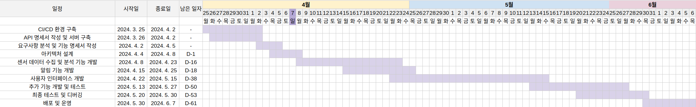

# Team4-Smoothing

- 김재혁
- 김지윤
- 박영준
- 배범익
- 신민석
- 우혜승
- 하지현

## 목차

1. 프로젝트 개요
   - 프로젝트 설명
   - 프로젝트 목표
   - 주요기능
2. 개발 일정
3. 개발 과정
4. 인력 및 개발
5. 질의 응답 및 피드백

---

## 1. 프로젝트 개요

### 프로젝트명: 전기절약 마스터(임시)

#### 프로젝트 설명

전기절약 마스터는 하루 전력 소비량을 관리하고 모니터링하여 전력 소비를 최적화하는 시스템입니다. 다양한 센서를 활용하여 전력 소비 패턴을 분석하고, 필요한 경우 사용자에게 알림을 전송하여 전력 낭비를 방지합니다.

#### 프로젝트 목표

- 하루 전력량을 설정하고 모니터링한다.
- 설정한 전력량을 초과할 경우 사용자에게 알림을 전송한다.
- 다양한 센서를 활용하여 전력 소비 패턴을 분석하고, 효율적인 전력 소비를 제안한다.
- 환경 최적화 기능을 통해 전력 소비를 최적화한다.
- 포인트 제도로 사용자 성취감을 올려 전력 소비를 줄인다.

#### 주요 기능

- **하루 전력량 설정**: 사용자는 하루 전력 소비량을 자동으로 설정하거나 수동으로 제한할 수 있다.
- **실시간 모니터링**: 다양한 센서를 통해 실시간으로 전력 소비량을 모니터링하고, 사용자에게 제공한다.
- **알림 기능**: 설정한 전력 소비 목표치를 초과할 경우 사용자에게 알림을 전송한다.
- **전력 소비 패턴 분석**: 센서 데이터를 기반으로 전력 소비 패턴을 분석하고, 효율적인 전력 소비를 제안한다.
- **환경 최적화**: 전력 소비를 최적화하는 다양한 서비스를 제공한다.
- **사용자 리워드 포인트 서비스**

---

#### <주요 기능 상세>

### 에너지 사용 분석 및 성능 추적
- 에너지 소비 절감 및 에너지 지속 가능성 목표 달성
- 시설 전체에서 에너지가 어떻게 소비되지 파악하고 비정상적인 에너지 사용을 사전에 감지합니다.
- 에너지 표준화 도구를 사용하여 집약도 *KPI 추적을 위해 생산의 맥락에서 에너지를 모니터링합니다.
- 에너지 성능, 탄소 감소 및 규제 준수 보고서를 자동으로 생성합니다.
 - *KPI : Key Perfomance Indicator(핵심성과지표)

### 전력 시스템 모니터링 및 제어
- 에너지 사용 분석 및 성능 추적
- 시설 전체에서 에너지가 어떻게 소비되는지 파악하고 비정상적인 에너지 사용을 사전에 감지합니다.
- 에너지 표준화 도구를 사용하여 에너지 집약도 *KPI 추적을 위해 생산의 맥락에서 에너지를 모니터링 합니다.
- 에너지 성능, 탄소 감소 및 규제 준수 보고서를 자동으로 생성합니다.

### 전력 시스템 모니터링 및 제어
- 전력 가용성 및 전기 시스템 성능 극대화
- 전력 계측기를 설치하여 전력원에서 이르기까지 시설 전체의 전력 흐름을 실시간으로 확인 할 수 있습니다.
- 계전기 및 차단기를 사용하여 결함을 격리하고, 중요하지 않는 부하를 줄이며, 자동으로 대체 전원으로 전환합니다.
- 모든 전기 용량을 추적하여 균형을 유지하고 과부하를 방지하며 충분한 백업 전력 가용성을 보장합니다.
- 전력 이벤트 분석 및 전력 품질 교정
- 전력 가용성 및 전기 시스템 성능 극대화

---
## 2. 개발 일정

---

## 3. 개발 과정

- 기능 명세서 작성
- Figma를 통한 디자인 작업
- 센서 데이터 수집 및 분석 기능 개발
- 알림 기능 개발
- 사용자 인터페이스 개발
- 추가 기능 개발 및 테스트
- 최종 테스트 및 디버깅
- 배포 및 운영

---

## 4. 인력 및 개발(임시)

- **김재혁**: 센서 데이터 및 수집 담당
- **김지윤**: 알림 기능 개발 담당
- **박영준**: 개발 총괄 및 최종 테스트 담당
- **배범익**: 데이터 분석 개발 담당
- **신민석**: 사용자 인터페이스 개발 담당
- **우혜승**: 추가 기능 개발 및 테스트 담당
- **하지현**: 프론트 디자인 담당

---

## 5. 질의 응답 및 피드백

(질문과 답변 예시 혹은 피드백 내용)

